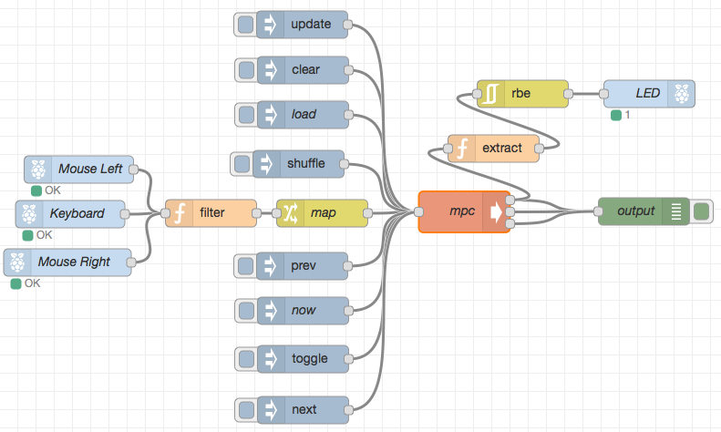

node-red
========

[](https://travis-ci.org/EasyPi/docker-node-red)
[](https://hub.docker.com/r/easypi/node-red)

ARCH   | IMAGE                    | SIZE
-------|--------------------------|--------
amd64  | [easypi/node-red][2]     | 69.55 MB
arm    | [easypi/node-red-arm][3] | 71.74 MB

[Node-RED][1] is a tool for wiring together hardware devices, APIs and online
services in new and interesting ways.



## directory tree

```
~/fig/node-red/
├── docker-compose.yml
└── data/
    ├── flows_cred.json
    ├── flows.json
    ├── lib/
    │   └── flows
    └── settings.js
```

> The `node-red/data` directory will be created after first running.

## docker-compose.yml

```yaml
node-red:
  image: vimagick/node-red
  ports:
    - "1880:1880"
  volumes:
    - ./data:/data
  restart: always
```

## settings.js

```javascript
module.exports = {

    adminAuth: {
        type: "credentials",
        users: [{
            username: "admin",
            password: "$2a$08$zZWtXTja0fB1pzD4sHCMyOCMYz2Z6dNbM6tl8sJogENOMcxWV9DN.",
            permissions: "*"
        }],
        default: {
            permissions: "read"
        }
    },

}
```

> Password hash can be generated by running `node-red-admin hash-pw`
> <https://nodered.org/docs/security>

## up and running

```bash
$ docker-compose up -d

$ docker-compose exec node-red node-red-admin hash-pw
>>> Password: ******
... $2a$08$zZWtXTja0fB1pzD4sHCMyOCMYz2Z6dNbM6tl8sJogENOMcxWV9DN.

$ vi data/settings.js

$ docker-compose exec node-red bash
>>> cd /data
>>> apk add -U build-base
>>> npm install node-red-node-irc
>>> npm install node-red-node-daemon
>>> exit

$ docker-compose restart
```

> Install nodes from [node-red-nodes](https://github.com/node-red/node-red-nodes).

[1]: http://nodered.org/
[2]: https://hub.docker.com/r/easypi/node-red
[3]: https://hub.docker.com/r/easypi/node-red-arm
